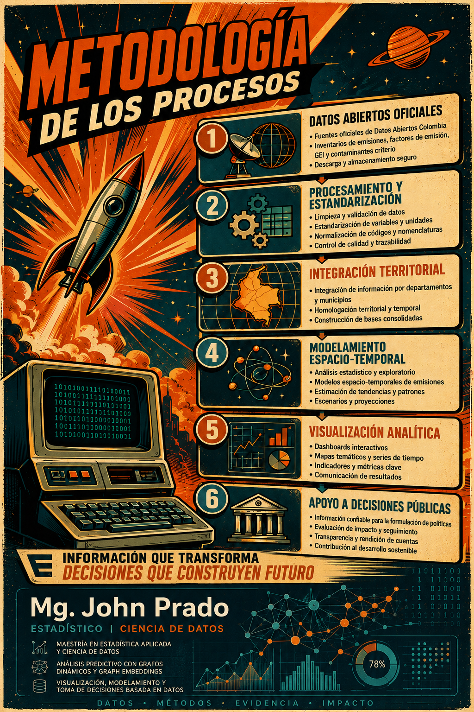
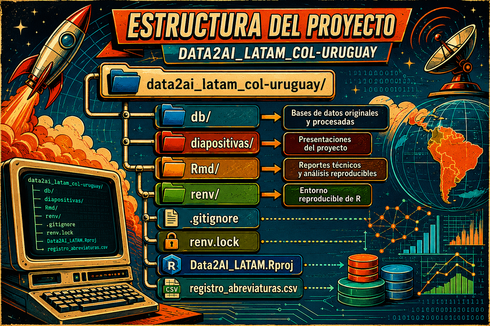

# 1. Descripción General

Data2AI LATAM Challenge es una iniciativa orientada al desarrollo de una arquitectura analítica reproducible para transformar datos abiertos oficiales en evidencia territorial comparable que apoye la toma de decisiones públicas relacionadas con adaptación climática, gestión ambiental y planificación territorial. El proyecto propone la construcción de un índice espacio-temporal denominado IRC-Col (Índice de Riesgo Climático para Colombia), utilizando integración multifuente de datos abiertos oficiales a nivel Departamento × Año. La solución busca resolver un problema estructural identificado en múltiples territorios de América Latina: la existencia de datos abiertos no garantiza decisiones públicas comparables debido a diferencias metodológicas, fragmentación de información y ausencia de estandarización territorial y temporal.

# 2. Problema

Actualmente múltiples territorios enfrentan limitaciones críticas en el uso de datos abiertos para planificación climática y ambiental. Los principales problemas identificados corresponden a fragmentación de datos provenientes de múltiples fuentes sin estándares homogéneos, series temporales incompletas o metodológicamente inconsistentes, diferencias estructurales entre datasets oficiales, ausencia de comparabilidad territorial y temporal, planeación pública aislada y dificultad para priorizar medidas de adaptación climática basadas en evidencia. Estas limitaciones impiden construir herramientas comparables que permitan apoyar decisiones públicas consistentes entre regiones y períodos históricos.

# 3. Objetivo General

El objetivo principal del proyecto consiste en desarrollar una plataforma analítica basada en un índice espacio-temporal de riesgo climático denominado IRC-Col, utilizando datos abiertos oficiales para evaluar, proyectar y priorizar medidas de adaptación climática en Colombia. El propósito central es generar evidencia comparable capaz de apoyar decisiones públicas territoriales mediante metodologías reproducibles y estructuras analíticas consistentes.

# 4. Propuesta de Solución

El proyecto transforma datos abiertos oficiales dispersos en una herramienta integrada de diagnóstico climático territorial, comparabilidad espacio-temporal, modelamiento predictivo, simulación de escenarios, priorización de medidas de adaptación y visualización territorial orientada a tomadores de decisión. La arquitectura fue diseñada bajo principios de reproducibilidad, modularidad, escalabilidad, transparencia metodológica y trazabilidad analítica, permitiendo integrar múltiples datasets oficiales dentro de una estructura homogénea y comparable.

# 5. Metodología

# 5.1 Identificación del problema y definición conceptual

El proyecto inició con la identificación de limitaciones estructurales en el uso de datos abiertos para planificación climática y territorial. Se detectó que múltiples territorios utilizan metodologías distintas, escalas incompatibles y estructuras de datos fragmentadas, lo que dificulta generar evidencia comparable para apoyar decisiones públicas consistentes. A partir de este diagnóstico se definió el objetivo central del proyecto: construir una arquitectura reproducible capaz de integrar datos abiertos oficiales en un índice espacio-temporal comparable entre departamentos y años.

# 5.2 Recolección e integración de fuentes oficiales

Se consolidaron múltiples fuentes oficiales relacionadas con emisiones atmosféricas, gases de efecto invernadero, contaminantes criterio, carbono negro y factores de emisión. Los datasets provinieron de inventarios nacionales y registros institucionales con diferentes estructuras y niveles de granularidad. Durante esta etapa se diseñó una arquitectura de integración multifuente orientada a preservar la trazabilidad de cada variable y mantener consistencia metodológica entre datasets heterogéneos.

# 5.3 Estandarización estructural de los datasets

Se desarrolló un pipeline de limpieza estructural utilizando R y librerías especializadas del ecosistema tidyverse. El proceso incluyó normalización de nombres de columnas, corrección de encoding UTF-8, limpieza semántica y estandarización de variables categóricas. Esta etapa permitió reducir ambigüedad textual y mejorar la interoperabilidad entre datasets oficiales.

# 5.4 Limpieza y validación numérica

Se implementaron funciones específicas para detectar y corregir inconsistencias numéricas presentes en diferentes formatos internacionales. El procedimiento permitió transformar correctamente variables numéricas con distintos separadores de miles y decimales sin alterar la información original. Paralelamente se ejecutaron validaciones de integridad estructural para garantizar estabilidad dimensional durante todas las transformaciones.

# 5.5 Construcción de diccionarios y normalización semántica

Se desarrollaron diccionarios de abreviación y normalización semántica para variables categóricas extensas. El procedimiento incluyó generación automática de abreviaturas reproducibles, resolución de colisiones textuales y construcción de tablas auditables de correspondencia semántica. Esto permitió reducir redundancia textual sin comprometer interpretabilidad ni trazabilidad.

# 5.6 Auditoría de calidad y trazabilidad

Se ejecutaron procesos de auditoría orientados a validar consistencia estructural y semántica en todas las etapas del pipeline. Durante esta fase se evaluaron valores faltantes, duplicados, estabilidad dimensional y transformaciones aplicadas antes y después del procesamiento. Los resultados confirmaron que el pipeline preservó la totalidad de observaciones originales sin introducir pérdidas ni inconsistencias destructivas.

# 5.7 Construcción de datasets comparables

Los datasets finales fueron organizados bajo una estructura Departamento × Año para facilitar comparabilidad longitudinal y espacial. Esta unidad de análisis constituye la base metodológica para futuras etapas de modelamiento espacio-temporal y generación del índice IRC-Col.

# 5.8 Diseño de arquitectura analítica y modelamiento

El proyecto avanzó hacia una arquitectura analítica modular orientada a integración territorial, análisis espacial y modelamiento predictivo. Se definieron componentes para incorporación futura de modelos espacio-temporales, análisis de redes territoriales y simulación de escenarios climáticos.

# 5.9 Desarrollo de visualización y soporte a decisiones

Se diseñaron visualizaciones orientadas a tomadores de decisión, incluyendo mapas territoriales, rankings comparativos, escenarios climáticos y paneles de interpretación territorial. Estas visualizaciones buscan transformar información técnica compleja en evidencia interpretable para entidades gubernamentales, autoridades ambientales y organismos de cooperación internacional.

# 5.10 Estado actual del proyecto

Actualmente el proyecto se encuentra en una fase de Prototipo Analítico Avanzado o MVP científico-técnico. La arquitectura principal de integración, limpieza, auditoría y estructuración territorial ya fue validada mediante pipelines reproducibles. Aunque la plataforma aún no se encuentra desplegada operativamente, el sistema cuenta con bases metodológicas sólidas para escalamiento hacia dashboards interactivos, modelos predictivos y despliegue productivo.

# 6. Metodología

La siguiente arquitectura resume el flujo metodológico del proyecto desde la adquisición de datos abiertos oficiales hasta el apoyo a decisiones públicas mediante modelamiento espacio-temporal y visualización analítica.

  

La plataforma fue diseñada para permitir diagnóstico territorial histórico mediante análisis de riesgo climático, emisiones e impactos ambientales utilizando información comparable entre departamentos y años. Además, contempla generación de proyecciones espacio-temporales, simulación de escenarios con y sin intervención climática, construcción de rankings territoriales de priorización y desarrollo de visualizaciones interpretables orientadas a tomadores de decisión.

# 7. Tecnologías Utilizadas

El proyecto fue desarrollado principalmente utilizando R y RMarkdown como base del pipeline analítico y documental. Se emplearon librerías especializadas como tidyverse, janitor, stringi, stringr, VIM, naniar, mice, openxlsx y writexl para procesos de limpieza, auditoría, visualización y estructuración de datos. Adicionalmente, se utilizaron herramientas como RStudio, Git y renv para garantizar reproducibilidad y control de dependencias.

# 8. Estructura del Proyecto

  

# 9. Fortalezas del Proyecto

El proyecto presenta fortalezas importantes relacionadas con reproducibilidad, comparabilidad territorial, modularidad y transparencia metodológica. Toda la arquitectura fue diseñada mediante pipelines reproducibles y auditables, permitiendo mantener trazabilidad completa sobre cada transformación aplicada. La estructura Departamento × Año facilita análisis longitudinal y espacial consistente, mientras que la modularidad del sistema permite escalar la arquitectura e integrar nuevos datasets y componentes analíticos en futuras etapas.

# 10. Usuarios Objetivo

La solución está orientada principalmente a gobiernos departamentales y municipales, autoridades ambientales, entidades de planificación territorial, organismos de cooperación internacional y equipos especializados en análisis climático y ambiental. El objetivo es facilitar herramientas comparables y reproducibles para apoyar decisiones públicas basadas en evidencia territorial.

# 11. Líneas Futuras

Las siguientes etapas del proyecto contemplan construcción formal del índice IRC-Col, integración de modelos predictivos avanzados, incorporación de modelos espacio-temporales, implementación de arquitecturas GNN/ST-GNN, automatización ETL, desarrollo de dashboards interactivos y despliegue de una plataforma web analítica escalable hacia otros países de América Latina.

# 12. Estado del Proyecto

Actualmente el proyecto corresponde a un Prototipo Analítico Avanzado o MVP científico-técnico. La arquitectura principal ya fue desarrollada y validada mediante pipelines reproducibles, aunque todavía no corresponde a una plataforma completamente productiva ni desplegada operacionalmente. El sistema cuenta con bases metodológicas sólidas para evolucionar hacia una solución analítica territorial de escala institucional.

# 13. Autor

John Jairo Prado Piñeres, Maestría en Estadística Aplicada y Ciencia de Datos, Universidad El Bosque.

15. Referencias Técnicas

Los procesos metodológicos y pipelines utilizados en el proyecto fueron documentados mediante reportes técnicos reproducibles relacionados con inventarios nacionales de emisiones atmosféricas, factores de emisión, gases de efecto invernadero y contaminantes criterio.
